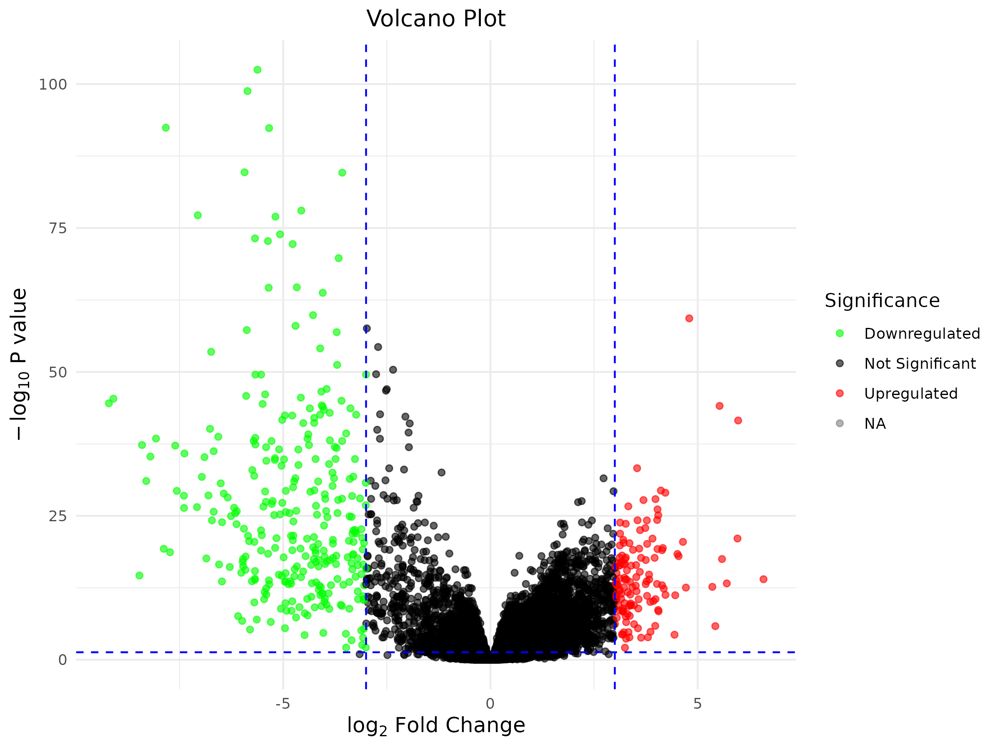
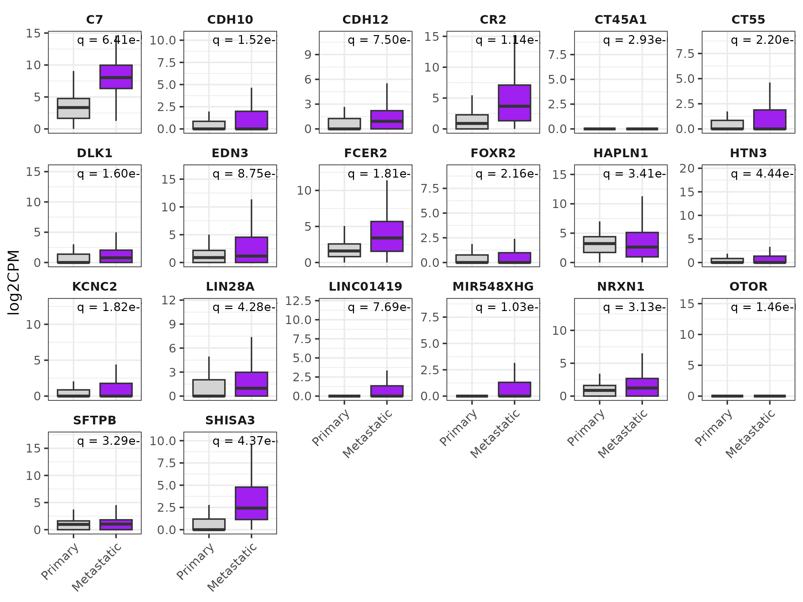
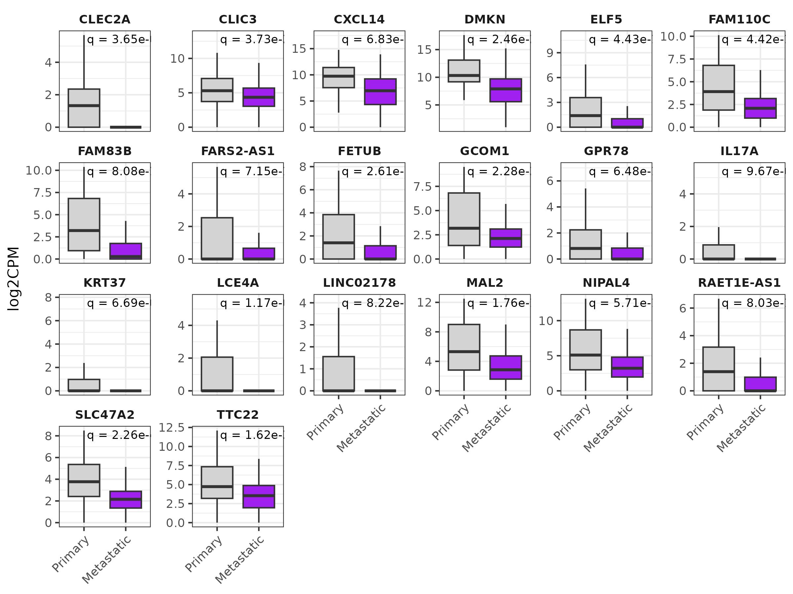
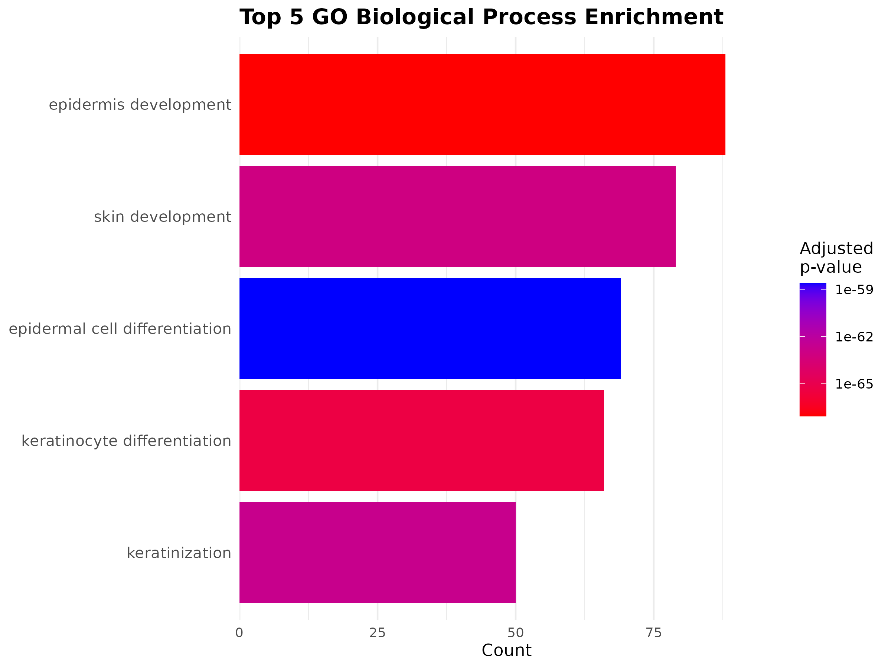
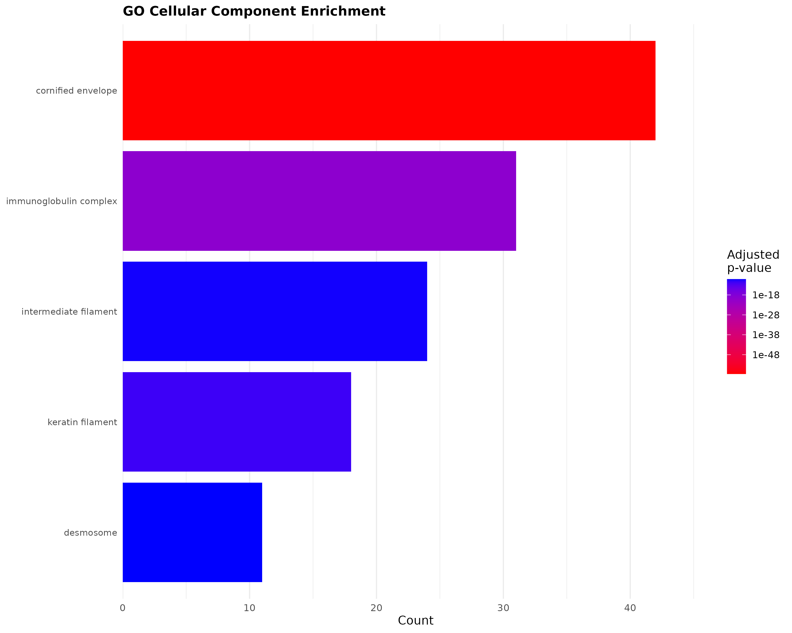

# Melanoma Analysis

This repository contains the code and analysis for a study on metastatic melanoma, aiming to identify novel therapeutic targets by comparing gene expression between primary and metastatic tumors.

## Project Overview

This project analyzes RNA sequencing data from The Cancer Genome Atlas (TCGA) to identify differentially expressed genes (DEGs) between primary and metastatic melanoma samples. The goal is to uncover potential biomarkers and therapeutic targets for treating metastatic melanoma.

The analysis involves:

*   **Data Acquisition:** Using melanoma data from the TCGA database.
*   **Differential Gene Expression Analysis:** Utilizing the DESeq2 R package to compare gene expression between 69 primary melanoma samples and 352 melanoma metastasis samples.
*   **Functional Enrichment Analysis:** Employing the KEGG and Gene Ontology (GO) databases to identify pathways and functions enriched with the identified DEGs.
*   **Genomic Integration Analysis:** Integrating external genomic databases to enhance the analysis with mutation data, protein-protein interactions, and clinical annotations.
*   **Visualization:** Generating volcano plots, box plots, and other visualizations to represent the results.

## Key Findings

The analysis identified 430 differentially expressed genes (DEGs), with 134 genes upregulated and 295 genes downregulated in metastatic samples compared to primary tumors. The study highlights several genes and pathways that may play a crucial role in melanoma metastasis.

## Visualizations

### Volcano Plot

The volcano plot shows the differentially expressed genes between primary and metastatic melanoma.



### Top 20 Upregulated and Downregulated Genes

The box plots below show the expression levels of the top 20 most significantly upregulated and downregulated genes.

**Upregulated Genes**



**Downregulated Genes**



### Functional Enrichment Analysis

The following plots show the results of the KEGG and Gene Ontology (GO) enrichment analyses.

**KEGG Pathway Enrichment**


**GO Biological Process Enrichment**



**GO Cellular Component Enrichment**



**GO Molecular Function Enrichment**


## Repository Structure

*   `code/`: Contains the R scripts for the analysis.
    *   `Differential_SCKM_analysis.R`: Script for performing the differential gene expression analysis.
    *   `Visualizations.R`: Script for generating plots and visualizations.
    *   `enrichemnt.R`: Script for the functional enrichment analysis.
*   `genomic_integration.R`: Script for integrating external genomic databases and resources.
*   `LICENSE`: The MIT License for this project.
*   `README.md`: This file.

## Getting Started

### Prerequisites

*   R and RStudio
*   The following R packages:
    *   `DESeq2`
    *   `ggplot2`
    *   `clusterProfiler`
    *   `org.Hs.eg.db`
    *   `biomaRt`
    *   `igraph`
    *   `STRINGdb`
    *   `dplyr`
    *   `tidyr`
    *   `data.table`

### Installation

1.  Clone the repository:

    ```
    git clone https://github.com/balqees-mansour/Melanoma-Analysis.git
    ```

2.  Install the required R packages:

    ```R
    install.packages(c("DESeq2", "ggplot2", "dplyr", "tidyr", "data.table"))
    if (!requireNamespace("BiocManager", quietly = TRUE))
        install.packages("BiocManager")
    BiocManager::install(c("clusterProfiler", "org.Hs.eg.db", "biomaRt", "igraph", "STRINGdb"))
    ```

### Usage

1.  Open the R scripts in the `code/` directory in RStudio.
2.  Modify the scripts as needed to specify input data paths and parameters.
3.  Run the scripts to perform the analysis and generate results.

## Data

The analysis was performed using data from The Cancer Genome Atlas (TCGA). The specific dataset used is the Skin Cutaneous Melanoma (SKCM) cohort.

## License

This project is licensed under the MIT License - see the [LICENSE](LICENSE) file for details.
